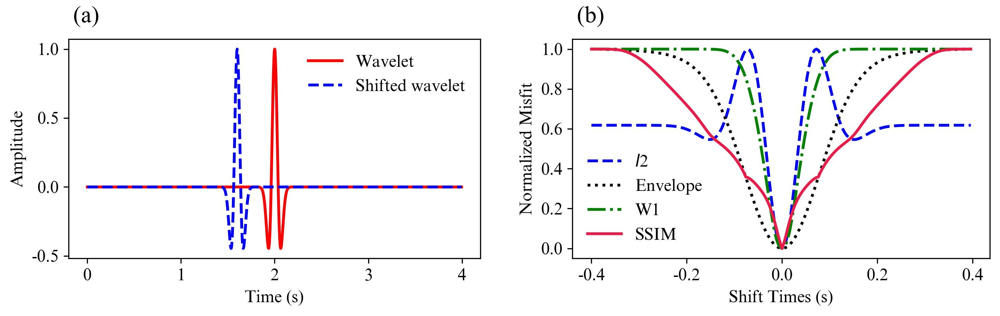
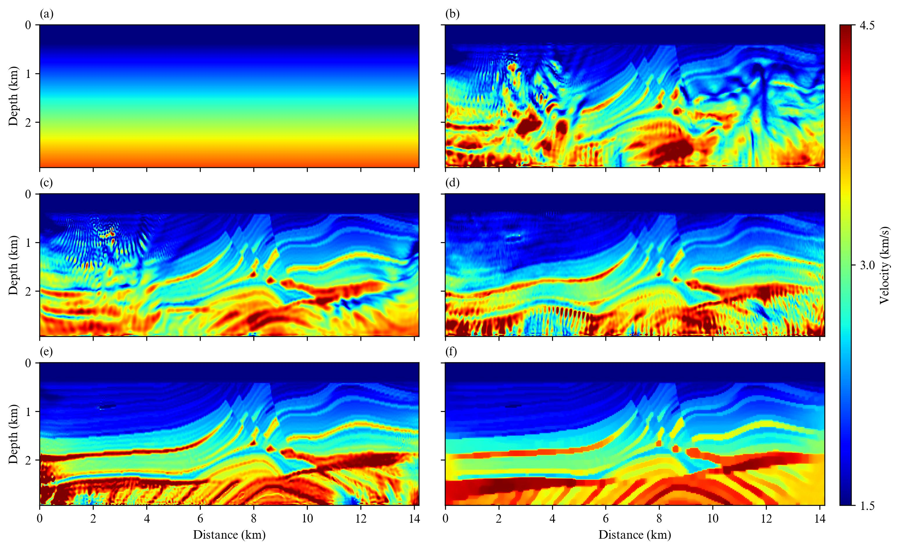

# SSIM-FWI

**This repository provides the official implementation for the paper "SSIM-FWI: Full Waveform Inversion based on Multi-scale Structural Similarity Index Measure", accepted by *Geophysics*.**

---

## Overview

Full waveform inversion (FWI) is a high-resolution seismic inversion technique popularly used in oil and gas exploration. Traditional FWI employs the $L_2$ norm measurement to minimize the misfit between observed and predicted seismic data, which easily suffers from cycle skipping when background velocity is inaccurate or data lacks low-frequency components.

To address this issue, we introduce a **multi-scale structural similarity index measure (M-SSIM)** objective function for FWI.

---

## Ricker Wavelet Misfit Function Test

A Ricker wavelet test is used to compare the behavior of different misfit functions.

<p align="center">
  
</p>

<p align="center">
  <b>Figure:</b> Ricker wavelet misfit function test: (a) Ricker wavelet and (b) normalized misfit.
</p>

The normalized misfit curves show the response of different objective functions to waveform shifts, providing an intuitive comparison of their sensitivity to cycle skipping.


## Inversion Results on the Marmousi Model

The effectiveness of different inversion methods is evaluated on the Marmousi velocity model. The initial model and the inversion results obtained using several objective functions are shown below.

<p align="center">
  
</p>

<p align="center">
  <b>Figure:</b> Inversion results on the Marmousi model: (a) initial velocity model, (b) FWI, (c) EI-FWI, (d) OT-FWI, (e) SSIM-FWI, and (f) regularized SSIM-FWI.
</p>

Among these methods, the SSIM-FWI approaches achieve more accurate recovery of the velocity structures than conventional methods. In particular, the regularized SSIM-FWI method improves structural continuity and better reconstructs the complex features of the Marmousi model.

---

## Multi-scale Structural Similarity

Multi-scale structural similarity extracts the local average amplitude, local energy, and local waveform features from the predicted and observed seismic data at multiple scales.

<p align="center">
  
</p>

<p align="center">
  <b>Figure:</b> Extraction and comparison of local average amplitude, local energy, and local waveform features from the predicted and observed seismic data at multiple scales.
</p>

These multi-scale structural features provide a more comprehensive measurement of the differences between the predicted and observed seismic data than conventional point-by-point waveform differences.


## Inversion Results on the Chevron Model

The effectiveness of the proposed method is further evaluated using the Chevron velocity model. The initial model, the inversion result obtained using conventional full waveform inversion, and the result obtained using the proposed method are shown below.

<p align="center">
  
</p>

<p align="center">
  <b>Figure:</b> Inversion results on the Chevron velocity model: (a) initial velocity model, (b) FWI, and (c) regularized SSIM-FWI.
</p>

Compared with FWI, the regularized SSIM-FWI provides improved reconstruction of the velocity structures and better structural continuity.

---


## Code

The main examples are provided in the following Jupyter notebooks:

- `FWI.ipynb`: Conventional full waveform inversion.
- `EI-FWI.ipynb`: Envelope-based full waveform inversion.
- `M-SSIM-FWI.ipynb`: Full waveform inversion using the multi-scale structural similarity objective function.

The objective functions are implemented in the `misfit/` directory.

---

## Requirements

The implementation is based on Python and PyTorch.

Main dependencies include:

```text
Python
PyTorch
NumPy
SciPy
Matplotlib
Deepwave
```

## Citation

If you use this code or find this work helpful in your research, please cite:

```bibtex
@article{he2026ssim,
  title     = {SSIM-FWI: Full Waveform Inversion based on Multi-scale Structural Similarity Index Measure},
  author    = {He, Liangsheng and Song, Chao and Liu, Cai},
  journal   = {Geophysics},
  year      = {2026},
  volume    = {95},
  pages     = {R225–R243},
  publisher = {Society of Exploration Geophysicists}
}
```
